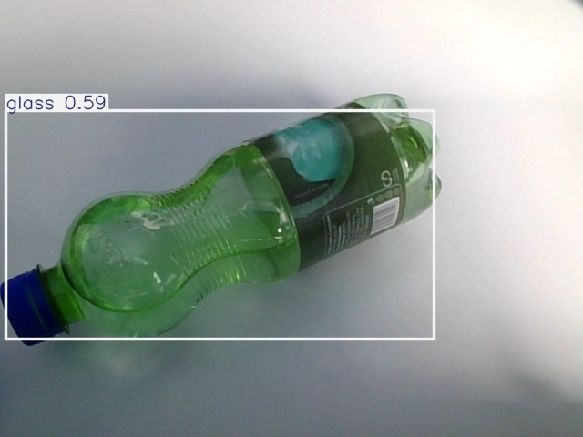
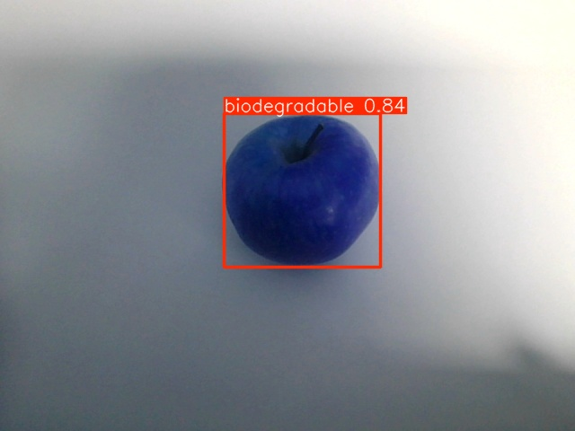
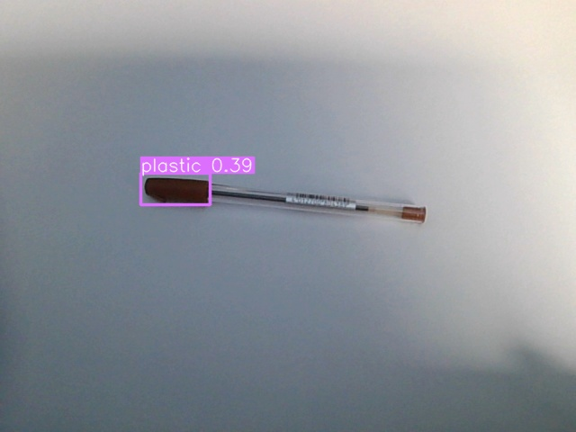

# ♻️ Garbage Sorting Robot with YOLOv5n-garbage

This demo showcases an automated waste sorting system using artificial intelligence. The system captures real-time images from a camera, identifies the type of waste using the YOLOv5n-garbage model, and controls a servomotor on a Raspberry Pi for physical sorting. Images are saved in both raw form and with annotations for later verification.

## ✅ Project Structure

```
/
├── src/
│   ├── model.py     # Loads the model and detection function
│   ├── control.py   # Servo control (RPi.GPIO)
│   └── main.py      # Main logic: capture, detection, control
├── data/
│   ├── input/       # Raw input images
│   └── output/      # Images with drawn predictions
├── weights/
│   └── best.pt      # Trained model weights
├── yolov5/          # YOLOv5 source code (cloned from GitHub)
├── requirements.txt # List of required packages
└── README.md        # Project documentation
```

## 🖼️ Prediction Examples

Test images with actual results from the YOLOv5n-garbage model:





## 📋 Requirements

- Python > 3.7
- Raspberry Pi or other camera-compatible device
- Minimum 1 GB free RAM
- Connected and properly configured camera

## ⚙️ Installation

### 1. Clone the project

```bash
git clone https://github.com/Bahna-Darius/garbage_sort
cd garbage_sort
```

### 2. Clone the YOLOv5 repository

```bash
git clone https://github.com/ultralytics/yolov5.git
```

### 3. Create a virtual environment and install dependencies

```bash
python -m venv venv
source venv/bin/activate  # or venv\Scripts\activate on Windows
pip install -r requirements.txt
```

## 🚀 Running the Demo

```bash
python src/main.py
```

## 📝 Usage Notes

- Make sure the camera is connected and functional before running
- Adequate lighting significantly improves detection accuracy
- Check the `data/output` folder for processed images and results

## 🔧 Troubleshooting

- **Camera error**: Check device connection and permissions
- **Servo problem**: Ensure GPIO pins are properly configured
- **Poor detection**: Adjust lighting and object positioning

## 📚 Resources

- [YOLOv5 Documentation](https://docs.ultralytics.com/)
- [Raspberry Pi GPIO Guide](https://www.raspberrypi.org/documentation/usage/gpio/)

## 📄 License

This project is distributed under a <a href="https://github.com/Bahna-Darius/garbage_sort/blob/main/LICENSE.md" target="_blank">Personal License</a>. See the LICENSE file for details.

## Author

This project was created and is maintained by Bahna Darius. You can find me on [LinkedIn](https://www.linkedin.com/in/darius-bahn%C4%83-2224b7264/).

